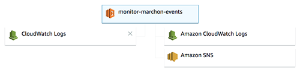

# Monitoring design

The Ragtag lambda monitoring solution involves the following AWS objects:

* **application** - the lambda resource to monitor. 
* **application service role** - the service role assigned to the application resource
* **application log** - the CloudWatch Logs group associated with the application resource.
* **monitor** - the monitoring resource. in the current design, every application requires a dedicated monitor instance. We're looking into ways to
   parameterize the monitor to allow the same monitor to support multiple applications.
* **monitor service role** - the security role assigned to the monitor resource.
* **monitor log** - the CloudWatch Logs group associated with the monitoring resource
* **monitoring subscription** - a CloudWatch Log subscription that invokes the monitor when it detects an application request has completed.
* **reporting topic** - an SNS topic used to deliver monitor reports to interested subscribers
* **reporting subscription** - a subscription on the reporting topic that delivers monitoring-related messages to end users or other channels.

# Packaging

Create monitoring lambda function
* zip deployment package

# Setup

Setup entails the following tasks:

1. Create logging policy for lambda functions
1. Verify/Update application lambda permissions
1. Create/Update the application log group
1. Configure application logging
1. Create the SNS reporting topic 
1. Create/update security role / permissions for monitoring component 
1. Create new lambda function for log analysis and reporting
1. Create new log subscription to watch application logs for request completion
1. Add a subscription delivery policy

## Create logging policy

The application lambda function must have permissions to update CloudWatch Logs. 
If needed, define an IAM policy named `logging` with the following definition:

	{
	    "Version": "2012-10-17",
	    "Statement": [
	        {
	        	    "Sid": "UpdateLogs",
	            "Action": [
	            	    "logs:DescribeLogGroups",
	                "logs:CreateLogGroup",
	                "logs:CreateLogStream",
	                "logs:PutLogEvents"
	            ],
	            "Effect": "Allow",
	            "Resource": "*"
	        }
	    ]
	}
	
Then create the policy

	aws iam create-policy \
	  --policy-name logging \
	  --description "Minimum permissions for creating log streams and writing log events." \
	  --policy-document file://logging-policy.json

## Configure the application security role

Add the `logging` IAM policy to the application service role (e.g. `marchon-lambda-role`).

	LOGGING_POLICY_ARN=`aws iam list-policies \
	          --output text \
	          --query "Policies[?PolicyName=='logging'].[Arn]"`
	aws iam attach-role-policy \
			--role-name "marchon-lambda-role" \
			--policy-arn "$LAMBDA_POLICY_ARN"
			
## Create application log group

If the application has already run (and had `CreateLogGroup` permissions), the CloudWatch logs group may already exist. Otherwise create it directly, as
`/aws/lambda/`*function-name*

	LOG_GROUP_NAME=/aws/lambda/<function-name>
	aws logs create-log-group --log-group-name $LOG_GROUP_NAME
	# set retention policy (optional, defaults to None)
	aws logs put-retention-policy \
	   --log-group-name $LOG_GROUP_NAME --retention-in-days 30

## Configure application logging

AWS Lambda will automatically log events when a request starts and ends. To add additional information about application progress, warnings, and errors, you can insert addition calls to the logging API, e.g.

	import logging
	logger = logging.getLogger()
	logger.setLevel(logging.INFO)
	def my_logging_handler(event, context):
	    logger.info('got event{}'.format(event))
	    logger.error('something went wrong')
	    return 'Hello from Lambda!'  

See [Logging](https://docs.aws.amazon.com/lambda/latest/dg/python-logging.html) for further details on using logging in AWS.

Do not change the default logging pattern. The monitoring service looks for specific fields in the log events.

## Create the reporting topic

The topic will be used to dispatch monitoring reports to interested subscribers.

	TOPIC_ARN=`aws sns create-topic --name app-monitoring-reports --output text`
	aws sns set-topic-attributes \
	        --topic-arn $TOPIC_ARN \
	        --attribute-name DisplayName \
	        --attribute-value "Topic for log monitoring"

## Configure monitor service role

Define a security policy with read/write access to the application log streams and publishing permissions on the SNS reporting topic, e.g.

	{
	  "Version": "2012-10-17",
	  "Statement": [
	  	{
            "Sid": "ReadLogs",
            "Effect": "Allow",
            "Action": [
                "logs:GetLogEvents",
                "logs:FilterLogEvents"
            ],
            "Resource": [
                "arn:aws:logs:us-east-1::log-group:$LOG_GROUP_NAME:log-stream:"
            ]
        },
        {
            "Sid": "PublishReports",
            "Effect": "Allow",
            "Action": [
                "sns:Publish"
            ],
            "Resource": [
                $TOPIC_ARN
            ]
        }
	  ]
	}
	
Create the policy

	aws iam create-policy \
	  --policy-name monitoring-lambda \
	  --description "Security policy for monitoring lambdas. Provides permissions to read CloudWatch logs and publish to SNS topics." \
	  --policy-document file://monitor-lambda-policy.json

Create or update the monitoring security role 
    
	aws iam create-role \
	   --role-name monitoring-lambda \
	   --description "Security role for monitoring lambda function executions. Provides permissions to access logs and publish to a topic." \
	   --assume-role-policy-document file://lambda-assume-role-policy.json
	ROLE_ARN=`aws iam list-roles --output text --query "Roles[?RoleName=='monitoring-lambda'].[Arn]"`

Add base and monitoring policies to security role

	LOGGING_POLICY_ARN=`aws iam list-policies --output text --query "Policies[?PolicyName=='logging'].[Arn]"`
	aws iam attach-role-policy \
			--role-name "monitoring-lambda" \
			--policy-arn "$LAMBDA_POLICY_ARN"
	MONITOR_POLICY_ARN=`aws iam list-policies --output text --query "Policies[?PolicyName=='monitoring-lambda'].[Arn]"`
	aws iam attach-role-policy \
			--role-name "monitoring-lambda" \
			--policy-arn "$MONITOR_POLICY_ARN"

## Create monitoring lambda function

Create a new lambda function for the application log monitoring callback.

### Using the console

##### Name

A name that identifies the monitor and associated application function, e.g. `monitor-marchon-events`.

##### Runtime

Select **Python 3.6**

##### Execution role

Select **Choose an existing role** and provide the monitor security role, e.g. `monitoring-lambda`

##### Function code

Upload the zip file (or s3?) created in the packaging step

##### Handler

Enter `monitor-marchon-events.lambda_handler`.

##### Environment Variables

Define the following required environment variables:

* **APPLICATION_NAME** - the friendly name of the application, used in reporting, e.g. "Marchon Events"
* **REPORTING_TOPIC_ARN** - the ARN of the reporting topic created earlier.

The following variables are optional, and used primarily for testing and debugging:

* **LOG_LEVEL** - log level for the monitoring application, defaults to `INFO`
* **DRY_RUN** - if `True`, dumps report messages to the monitoring log instead of publishing to the reporting topic. Default is `False`. Useful for verifying monitoring configuration prior to going live

##### Basic settings

Change the **Timeout** to 30 seconds.

### Using the AWS CLI

	aws lambda create-function \
	    --function-name monitor-marchon-events \
	    --runtime python3.6 \
	    --role "$ROLE_ARN" \
	    --handler monitor_lambda_runs.lambda_handler \
	    --zip-file fileb://monitoring.zip \
	    --description 'Monitor log output from lambda execution requests' \
	    --timeout 30 \
	    --environment "Variables={APPLICATION_NAME=\"Marchon Events\",REPORTING_TOPIC_ARN=$TOPIC_ARN}"
	 FUNCTION_ARN=`aws lambda list-functions --output text --query "Functions[?FunctionName=='monitor-marchon-events'].[FunctionArn]"`

## Configure the monitoring subscription

Create a new CloudWatch Logs subscription, as

log group: $LOG_GROUP_NAME
filter pattern: `[type=END,dummy,requestId,...]`
action: lambda, monitoring resource ARN

	aws logs put-subscription-filter \	
	  --log-group-name $LOG_GROUP_NAME \
	  --role-arn $LOG_SUBSCRIPTION_UPDATE_ROLE \ 
	  --filter-name "Lambda (monitor-marchon-events)" \
	  --filter-pattern "[type=END,dummy,requestId,...]" \
	  --destination-arn $FUNCTION_ARN

## Create the topic subscription

    aws sns subscribe --topic-arn $TOPIC_ARN --protocol email --notification-endpoint <email-address>
    
Someone with access to the endpoint email address will have to confirm the subscription (by clicking on a link in the confirmation request). The confirmation request will include the ARN of the subscription.

	SUB_ARN=<subscription-arn>

## Add a subscription delivery policy

Once the subscription has been confirmed by the recipient, you can (optionally) set a delivery policy to limit the messages forwarded to the endpoint.

	aws sns set-subscription-attributes -out text \
	        --subscription-arn $SUB_ARN \
	        --attribute-name DeliveryPolicy \
	        --attribute-value <filter-policy>
                                        
The *filter-policy* is a map of message attributes to possible values. For example, the following policy would only deliver reports for requests for a specific lambda function that had more than one error or warning:

	{
	  "name": "hello-world"
	  "status": ["error","warning"]
	}

Monitoring report messages support the following attributes:

* `function`  the lambda function name, e.g. `hello-world`.
* `name`      the application display name, e.g. "Hello world!"
* `status`    function execution status, one of `error`, `warning`, or `success`.
* `warnings`  the number of warnings reported
* `errors`    the number of errors reported

See [Filtering Messages with Amazon SNS](https://docs.aws.amazon.com/sns/latest/dg/message-filtering.html]) for more information about filter policies.

# Verify installation

The lambda function should look like the following:
    

# Notes

Consider defining a separate test monitor (with DRY_RUN true) and monitoring subscription for validation prior to updating production monitor lambda.
